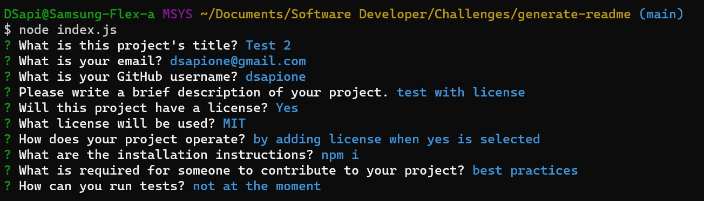

# Generate README

## Description

Generates a README.md based on user input. Allows you to choose what license you need to add to the readme and adds the appropriate badge.

## Table of Contents

* [Installation](#installation)
* [Usage](#usage)
* [Contributing](#contributing)
* [Tests](#tests)
* [Questions](#questions)

## Installation

You will need to have node.js installed, and run 'npm i' on the cmd line so inquirer will download after you clone the repo.

## Usage

Run 'node index.js' on the cmd line to start the application which will then use inquirer to prompt questions about your project to generate the README.md. Once built it will be displayed in the dist. folder.

## Contributing

Please follow best practices.

## Tests

No tests at the moment.

## Questions

If you have an questions feel free to contact me via [Email](dsapione@gmail.com)
and checkout my other projects on [GitHub](https://github.com/dsapione).
